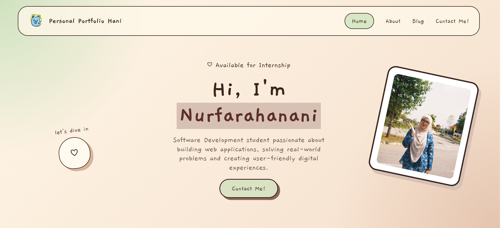
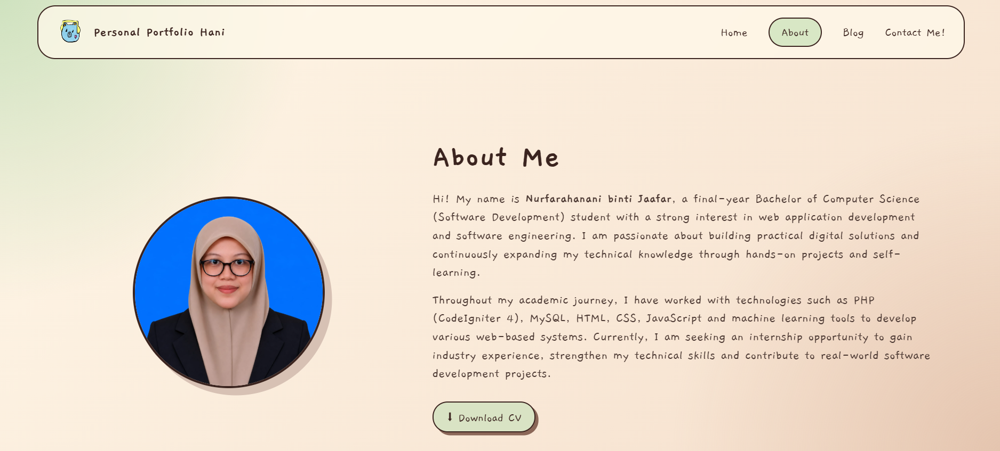
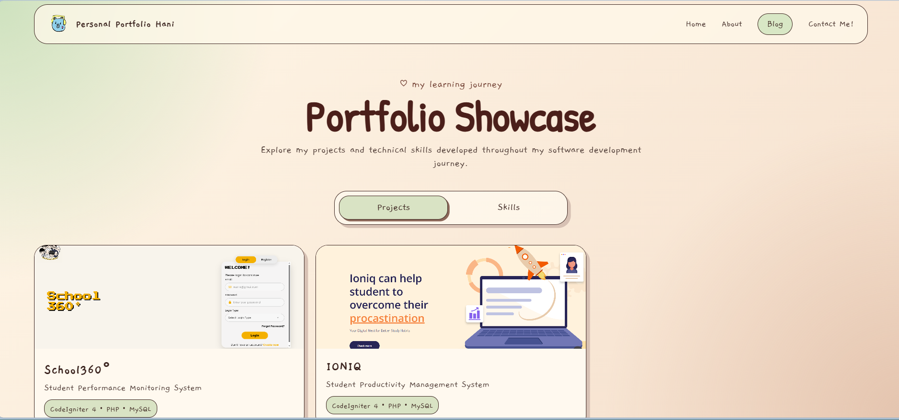
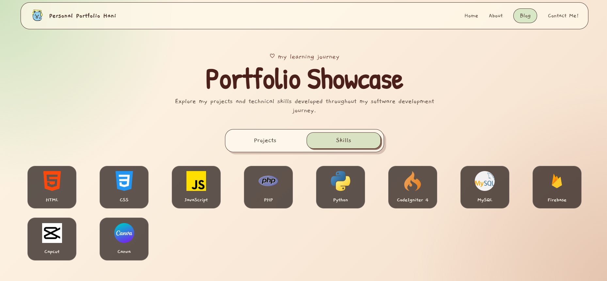
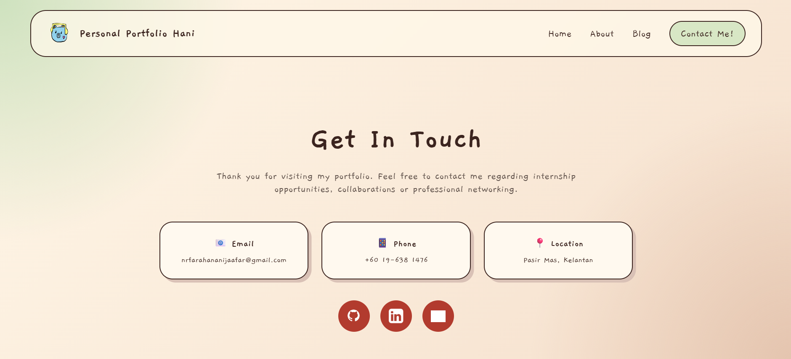

# Project Title: GitHub Portfolio (Personal Blog Page ) 

## Description

This project is a personal portfolio website developed to showcase my background, technical skills, projects and contact information. The website serves as an online portfolio for internship and career opportunities.

## Features

* Responsive Home Page
* About Me Section
* Download CV Function
* Project Showcase
* Skills Showcase
* Contact Information Page
* Mobile Friendly Navigation

## Technologies Used

* HTML5
* CSS3
* JavaScript

### Screenshots
* Home Page

* About Page

* Blog Page

* Contact Page

### How to run the project

1. Download or clone this repository.
2. Open the project folder in Visual Studio Code.
3. Install the Live Server extension (optional).
4. Open index.html.
5. Run the website using Live Server or open it directly in a web browser.
6. Navigate through the Home, About, Blog and Contact pages.

### Demo Link

* GitHub Repository: 

https://github.com/nurfarahanani/personal-blog-page

* Live Website (GitHub Pages):

https://nurfarahanani.github.io/personal-blog-page/

## Author

**Nurfarahanani Binti Jaafar**
**Matric Number: 076946**

